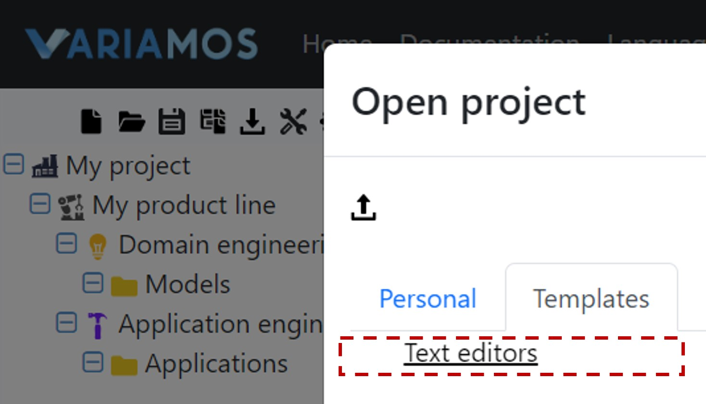

# Text Editors Product Line

This project is a example of a text editors product line.

## Edit project in VariaMos Framework

1. Open the following link in a new tab <a href="https://app.variamos.com/" target="_blank">VariaMos Framework</a>
2. Log in as a guest or register using a Google account as shown in the image.
    
3. Select the "Open project" option (Folder icon), then go to the Templates tab and select the Text Editors project as shown in the image.
    
4. Navigate the project explorer and select the models you wish to view or edit as shown in the figure.
    

## Resources

In the `Images` folder, you will find images of some models of the product line design.
 
